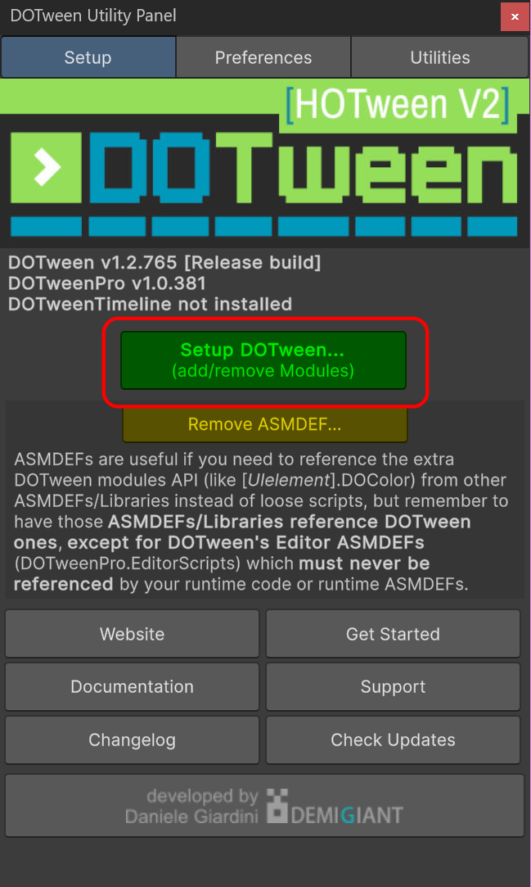
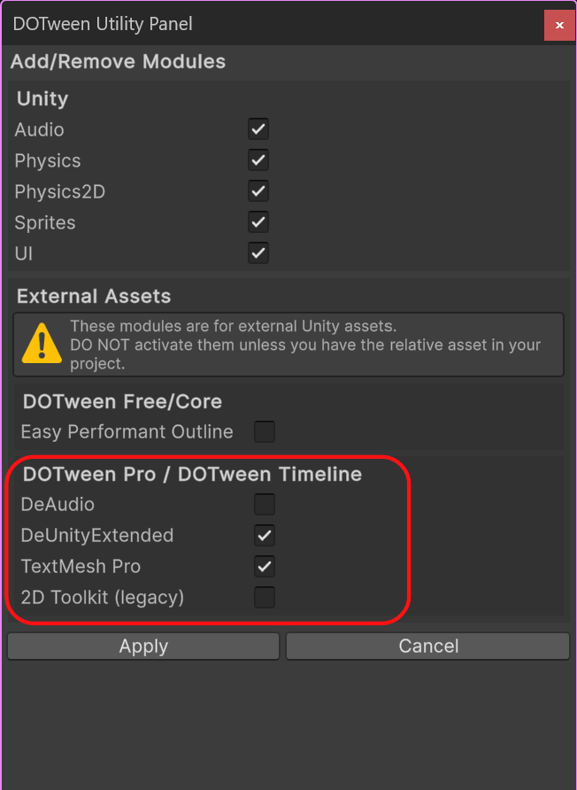
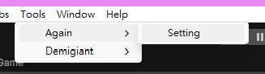
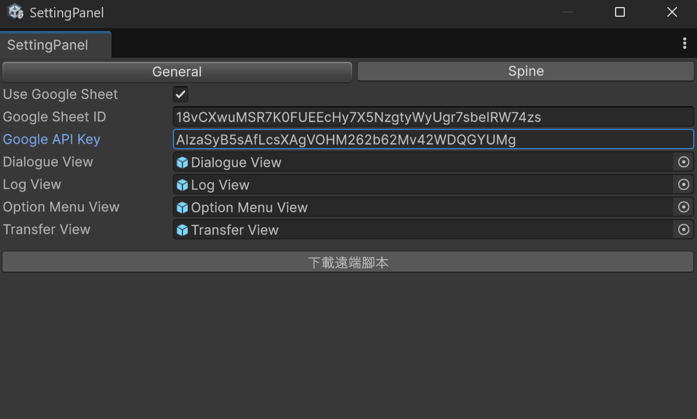
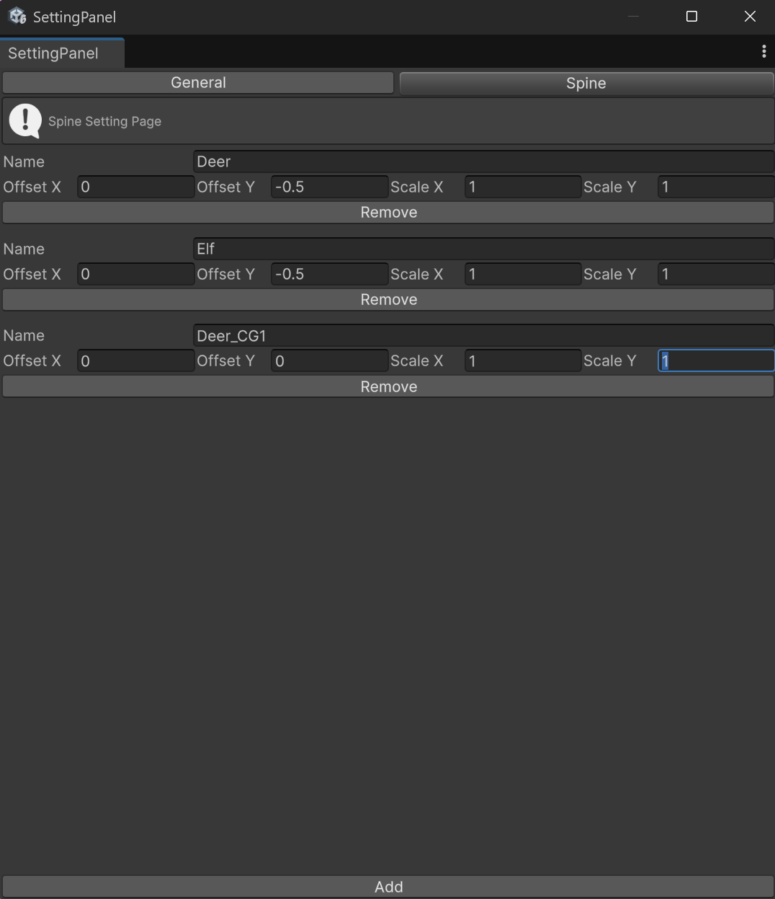

# Again System 開發教學 For RD

## 安裝
- 到PackageManager安裝[InputSystem](https://docs.unity3d.com/Packages/com.unity.inputsystem@1.7/manual/Installation.html)套件，裝完會跳出彈窗問要不要切到新的InputSystem，選是並自動重開Unity
- 安裝[Unity Spine](https://zh.esotericsoftware.com/spine-unity-installation#%E4%BD%BF%E7%94%A8Unitypackage%E5%AE%89%E8%A3%85%E8%BF%90%E8%A1%8C%E6%97%B6)
- 下載`AgainSystem.unitypackage`，將檔案匯入Unity
- 設定DOTewwn
  - Unity上方 Tools > Demigiant > DOTewwn Utility Panel開啟
  - 確認額外的模組有勾選
  - 
  - 
- 從 Unity上方 Tools > Again > Setting開啟設定面板
  - 點擊 `建立設定檔` 按鈕
- 開啟 `Assets/Plugin/AgainExample/Scenes/HelloWorld`，執行場景，確認有AVG正常執行

## 範例
- AgainExample/Scenes/HelloWorld
  - 最簡單的範例，執行HelloWorld腳本
- AgainExample/Scenes/SpriteEditor
  - 可以快速測試已有的腳本
  - 記得要到設定面板更新GoogleSheetId
- AgainExample/Scenes/SpriteEditorOrtho，同上但相機為正交相機
  
## 新增Google Sheet遠端腳本
- 各專案都會有一個自己的GoogleSheet，用來編輯腳本
- 開啟[範例腳本](https://docs.google.com/spreadsheets/d/18vCXwuMSR7K0FUEEcHy7X5NzgtyWyUgr7sbeIRW74zs/edit?gid=1492752394#gid=1492752394)，點擊左上檔案>建立副本，複製試算表
- 新的試算表網址中`https://docs.google.com/spreadsheets/d/XXXXX/edit`，`XXXXX`即為`Google Sheet ID`
- 之後企劃可以在google sheet新增分頁並編輯腳本
- Unity這邊到[設定面板](#設定面板)更新 `Google Sheet ID` 就能在遊戲中使用

## 設定面板
- 可從Unity上方 Tools > Again > Setting開啟
  - 
-   General分頁
    
    - Use Google Sheet
      - 是否使用遠端腳本，沒勾的話會改找本地端 `Resources\CSV` 的腳本
    - Google Sheet ID
      - Use Google Sheet 打勾時才會顯示
      - 遠端腳本的 Google Sheet Id
      - 試算表網址中`https://docs.google.com/spreadsheets/d/XXXXX/edit`，`XXXXX`即為`GoogleSheetId`
    - Google API Key
      - Use Google Sheet 打勾時才會顯示
      - 用來獲取Google Sheet有哪些分頁等資料
      - 有提供一組預設的，sheet是公開的話就抓的到
      - 有需要非公開可以自行申請並更換 ([教學](https://handsondataviz.org/google-sheets-api-key.html))
    - DialogueView, LogView, OptionMenuView, TransferView
      - 可更換的Prefab物件
      - 可以到 `Plugins/Again/Prefabs/Components` 文件夾下找到預設的 Prefab，複製這些Prefab客製改成自己的樣式後在這邊更新，遊戲啟動時就會改用客製的Prefab來生成AVG畫面
    - 下載遠端腳本
      - 下載Google Sheet所有腳本到本地 `Assets/Resources/CSV` 文件夾
-   Spine分頁
      
      - 可以設定Spine的預設偏移和大小
      - 當使用人物立繪時，美術會將錨點設在下方(腳底位置)，生成Spine預設繪依錨點將它擺在畫面正中央顯示，而造成Spine偏上每次呼叫ShowSpine都要給一次定位，此時可以在這裡提供預設值解決問題。
      - 下方 Add 按鈕可以新增一筆資料
      - Offset X的單位為Spine的寬； Offset Y的單位為Spine的高

## 如何新增一個 AgainSystem 到新場景
- 將`Prefab/AgainSystem`或`Prefab/AgainSystemOrtho`擇一放入場景中
- 找到遊戲的 MainCamera
  - Tag 設為 MainCamera
  - Rendering 的 Culling Mask 將 `Avg` 取消勾選
  - 加上 AudioListener 組件(沒有的話)
  - 之後 AVG 的 Camera 會用 Overlay 的方式將畫面加到 MainCamera)
- 場景中新增一個EventSystem
- 場景中新增一個空物件，並加上程式碼
  ```csharp
  private void Start()
  {
      // 執行腳本
      // HelloWold為GoogleSheet上其中的一個腳本
      AgainSystem.Instance.Execute("HelloWorld");
  }
  ```
- 執行場景，確認AVG正常執行

## 資源放置
- 資源要放在對應的資料夾下，系統才找的到圖和Spine，否則會直接跳過指令
  - Assets/Resources/Images，背景圖&圖片
  - Assets/Resources/Spines，Spine動畫
  - Assets/Resources/CSV，本地腳本
  - Assets/Resources/Sounds，音效

## Prefabs
- 以下介紹Again/Prefabs底下的預置物件
- AgainSystem
  - 主要的AVG系統Prefab
- AgainSystemOrtho
  - 一樣是AVG系統Prefab
  - 但相機為正交相機，沒有近大遠小，較容易理解，但運鏡拉近功能(LookAtSpine)無效
- Internal Components
  - 內部用的 Prefabs，請無視
- Components
  - Dialogue View
    - 對話框
    - 搭配 `Say` 、 `ShakeDialogue` 等指令使用
    - 提供 顯示/隱藏、顯示對話紀錄、加速、跳過按鈕
    - TextSize: 對話框文字大小
    - TextSpeed: 文字播放速度
    - WaitSprite: 文字播放中的等待圖示
    - NextSprite: 文字播放完成的圖示
  - Option Menu View
    - 選項選單
    - 搭配 `OptionMenu` 指令使用
  - Option Button
    - 選項按鈕
    - 要客製可以客製一個 Option Menu View，並更換它的Button Prefab
  - Log View
    - 對話紀錄畫面
    - (開發中)

  
## Again System Prefab層級介紹
- AgainSystem
  - Camera
    - AVG使用的相機，Render type 使用 `Overlay`，顯示AVG時會加到主相機上
  - MAIN
    - 主元件，[AgainSystem](#againsystem-class)和所有[Managers](#managers-classes)都在這
  - Stage Canvas
    - 放置場上背景, 圖片, Spine的地方，基本上不會動到
  - UI Canvas
    - 場景啟動時會將對話框等Prefabs建立並放到這邊
    - Screen Mask View
      - 黑幕，用來遮蔽左右超過1920的畫面

## AgainSystem Class 
- AgainSystem 是最上層的物件，是一個Singleton，可以透過AgainSystem.Instance取得
- 可用屬性:
  - OnScriptFinished: 腳本執行完畢的回調
- 執行腳本
  - ```csharp
      AgainSystem.Instance.Execute(scriptName);
    ```
- 執行指令集
  - ```csharp
      AgainSystem.Instance.RunCommands(commands);
    ```
- 設定語言
  - ```csharp
      AgainSystem.Instance.SetLanguage(language);
    ```
  
## Managers Classes
  - 可以從`AgainSystem.Instance.XXXManager`取得使用，但基本上除了EventManager不太會動到
  - EventManager: 事件處理
  - SpineManager: 管理Spine動畫
  - ImageManager: 管理圖片和背景
  - CameraManager: 處理相機的運鏡
  - DialogueManager: 管理對話框和選像
  - AudioManager: 管理音效撥放

## 事件處理
  - 腳本有一個Emit指令，執行到時AgainSystem會發出Event
  - 監聽事件方法
    ```csharp
    private void OnEnable()
    {
        AgainSystem.Instance.EventManager.On("EventName", OnEvent);
        AgainSystem.Instance.EventManager.On<List<string>>("EventName", OnEventWithParameters);
    }

    private void OnDisable()
    {
        AgainSystem.Instance.EventManager.Off("EventName", OnEvent);
        AgainSystem.Instance.EventManager.Off<List<string>>("EventName", OnEventWithParameters);
    }

    private void OnEvent()
    {
        // 處理事件
    }

    private void OnEventWithParameters(List<string> parameters)
    {
        // 處理事件
    }
    ```

## 顯示層級
- 背景 0
- 圖片、Spine 100
  - ShowImage, ShowSpine 有Order參數可以調整
- 對話框 200
- 選項 300
- 對話紀錄 400
- 轉場 500
- 黑邊 600

## 多語言
- AVG多語言的翻譯會放在`Translation`分頁中
- 腳本頁會Say指令會有個參數`Key`，對應到`Translation`中的`Key`
- 可用`AgainSystem.Instance.SetLanguage(Language.Chinese)`切換中文等語言
  
## 改為讀取本地腳本
- 到[設定面板](#設定面板)先點擊 `下載遠端腳本` 按鈕下載到本地端
- 取消勾選 `Use Google Sheet` 選項
- 重新啟動遊戲時，就會改讀取`Assets/Resources/CSV` 文件夾底下的腳本

## 程式碼架構
- (TODO) 待更新
- `AgainSystem` - 主要系統，負責管理設定值和所有模組
- `Commands`
  - `Command.cs` - 指令的基底類別
  - `...Command` - 其他實際指令
- `Components`
  - `Manager` - 系統核心模組目錄
    - `CameraManager.cs` - 管理攝影機的 Unity Component
    - `DialogueManager.cs` - 管理對話欄的 Unity Component
    - `SpineManager.cs` - 管理 Spine 的 Unity Component
    - `SpineManager.cs` - 管理 Image 的 Unity Component
    - `EventManager.cs` - 事件處理
- `ScriptImpoter` - 載入和處理AVG腳本
  - `GoogleSheetImporter` - 讀取 Google Sheet 資料
  - `LocalSheetImporter` - 讀取本地 Sheet 資料
  - `ScriptSheetReader` - 解析轉換成Command